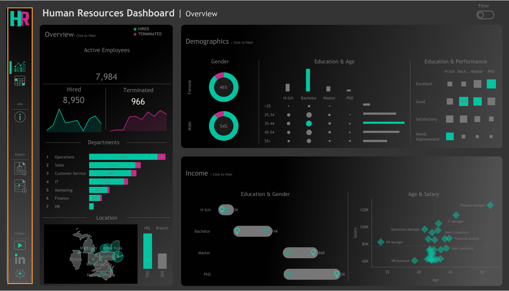
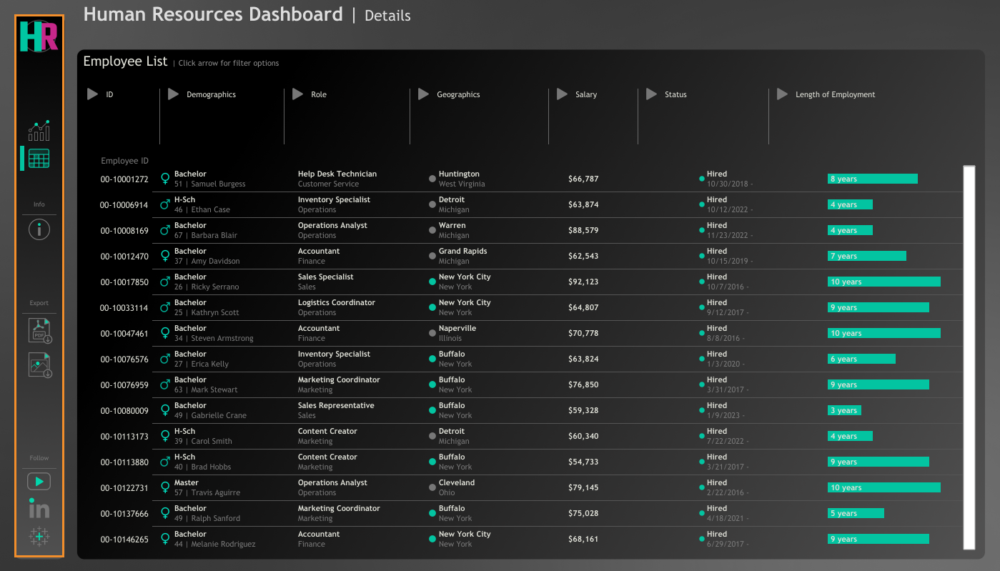

# 📊 HR Analytics Dashboard

## 🔗 Live Dashboard

👉 *https://public.tableau.com/views/HR_DashBoard_17747188525230/HRSummary?:language=en-US&:sid=&:display_count=n&:origin=viz_share_link*


---

## 🚀 Overview

This project is an **end-to-end HR Analytics Dashboard** designed to simulate real-world workforce analysis. It combines **synthetic data generation using Python** with **interactive visualization in Tableau** to provide actionable HR insights. This project demonstrates the ability to build a **complete data workflow**, from data generation to visualization, while focusing on solving real-world business problems in HR analytics.

The dashboard supports both:

* **High-level summaries** for strategic decision-making
* **Detailed employee-level analysis** for deeper insights




---

## 🎯 Objective

To help HR managers:

* Track hiring and attrition trends
* Analyze workforce demographics
* Identify salary patterns and disparities
* Explore employee-level data dynamically

---

## 🧩 Dashboard Structure

### 📌 1. Summary View

#### 🔹 Overview

* Total number of:

  * Hired employees
  * Active employees
  * Terminated employees
* Hiring vs termination trends over time
* Employee distribution by:

  * Department
  * Job Title
* HQ vs Branch comparison (New York as HQ)
* Geographic distribution (State & City)

---

#### 🔹 Demographics

* Gender ratio analysis
* Distribution across:

  * Age groups
  * Education levels
* Employee count by:

  * Age group
  * Education level
* Correlation:

  * Education vs Performance rating

---

#### 🔹 Income Analysis

* Salary comparison:

  * Across education levels
  * Between genders
* Relationship between:

  * Age and salary
  * Department-wise salary trends

---

### 📋 2. Employee Records View

* Detailed employee table including:

  * Name
  * Department
  * Job Title
  * Gender
  * Age
  * Education
  * Salary
* Dynamic filtering across all columns

---

## 🧪 Data Generation

A custom Python script was developed to generate a **realistic HR dataset of 8,950 records** with controlled distributions and constraints.

### 🔧 Dataset Features

* Unique Employee ID
* Randomly generated names
* Gender distribution:

  * 46% Female
  * 54% Male
* Location mapping (State & City)
* Hire dates (2015–2024 with weighted probabilities)
* Department and job title hierarchy
* Education level mapped to job roles
* Performance ratings with defined probabilities
* Overtime status (30% Yes, 70% No)
* Salary ranges based on role and department
* Birth dates consistent with job roles and hiring dates
* 11.2% employee attrition with valid termination dates
* Adjusted salary based on:

  * Gender
  * Education
  * Age

---

## 🛠️ Tech Stack

* **Python (Pandas, NumPy)** – Data generation & preprocessing
* **Tableau** – Data visualization & dashboard creation
* **GitHub** – Version control & project showcase

---

## 📊 Key Insights

* Workforce growth and attrition trends over time
* Salary disparities across gender and education levels
* Department-wise employee distribution
* Relationship between age, experience, and salary
* Impact of education on performance

---

## 💼 Business Impact

This dashboard enables:

* Data-driven HR decision-making
* Identification of compensation gaps
* Improved workforce planning
* Better understanding of employee demographics

---

## 🧠 Skills Demonstrated

* Data Generation & Simulation
* Exploratory Data Analysis (EDA)
* Data Visualization & Storytelling
* Dashboard Design (Tableau)
* Business Insight Development

---

## 📂 Project Structure

```
HR-Analytics-Dashboard/
│
├── images/
│   ├── HR_Summary.png
│   ├── HR_Details.png
│
└── README.md
```

---

## 🙏 Acknowledgement

This project was completed by following an online tutorial by Data with BaRAA as part of my hands-on learning in data analytics and Tableau dashboard development.

👉 *https://www.datawithbaraa.com/wiki/tableau#tableau-hr-project*

